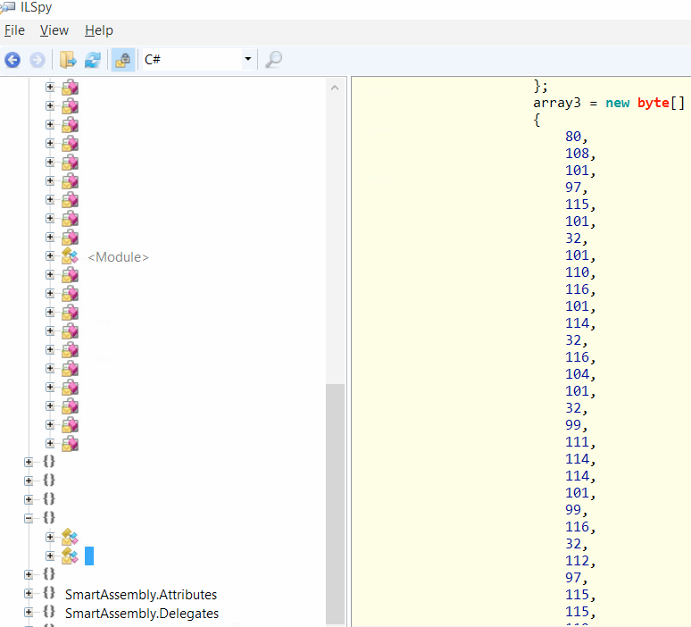
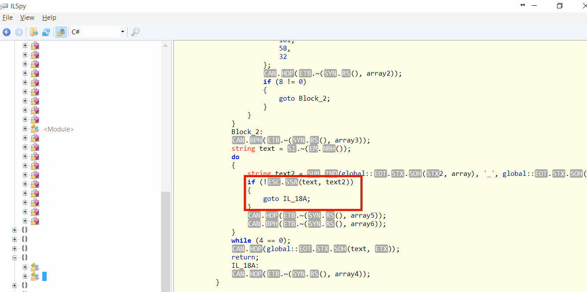
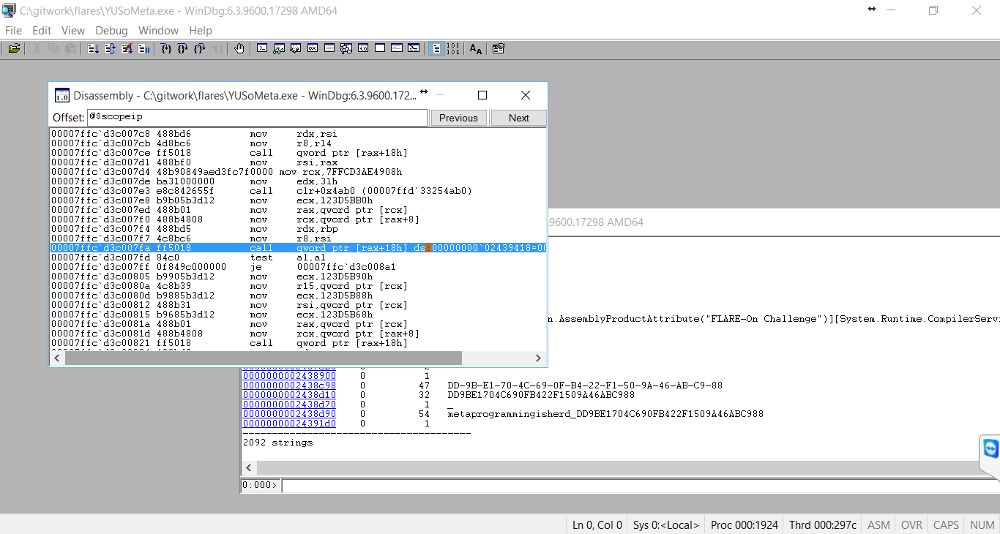
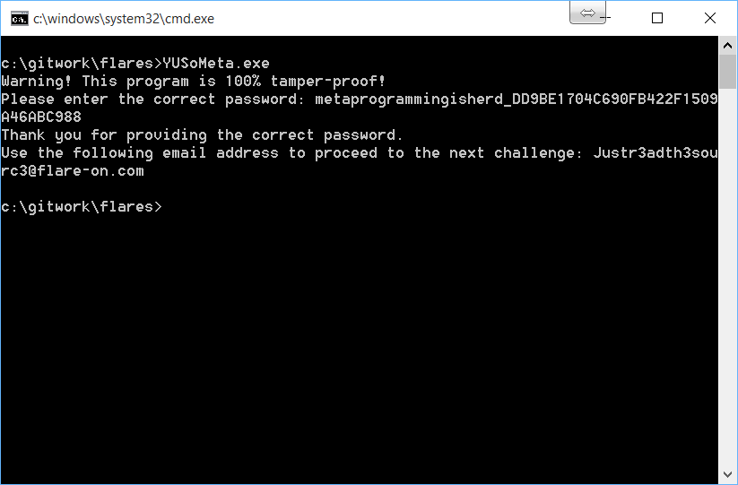

# Challenge 7

This is a heavily obfuscated .NET package. I tried opening it to find a string that I can use as a starting point, while clicking away, I found an array. Pasting it to Python:




```python
     a = [80, 108, 101, 97, 115, 101, 32, 101, 110, 116, 101, 114, 32, 116, 104, 101, 32, 99, 111, 114, 114, 101, 99, 116, 32, 112, 97, 115, 115, 119, 111, 114, 100, 58, 32]
     print "".join([chr(x) for x in a])
    'Please enter the correct password: '
```

Ok, this is a good point to start. Looking a bit further, I saw a comparison. 




Well, if we can debug this, the problem is solved.  Not knowing much about .NET, I tried to read as much as possible, and I found something called `sos.dll` and `sosex.dll`.

Now its time to use WinDBG. My logic is simple: try to break the result of `System.Concole.ReadLine`


    sxe ld:clrjit
    g
    .load C:\gitwork\sosex\sosex.dll
    !mbm System.Console.ReadLine
    g
    gu
    step over few times until before the comparison call
    !strings
    


Wait, whats that last string? it looks like a password

    metaprogrammingisherd_DD9BE1704C690FB422F1509A46ABC988
    
Yup it is



