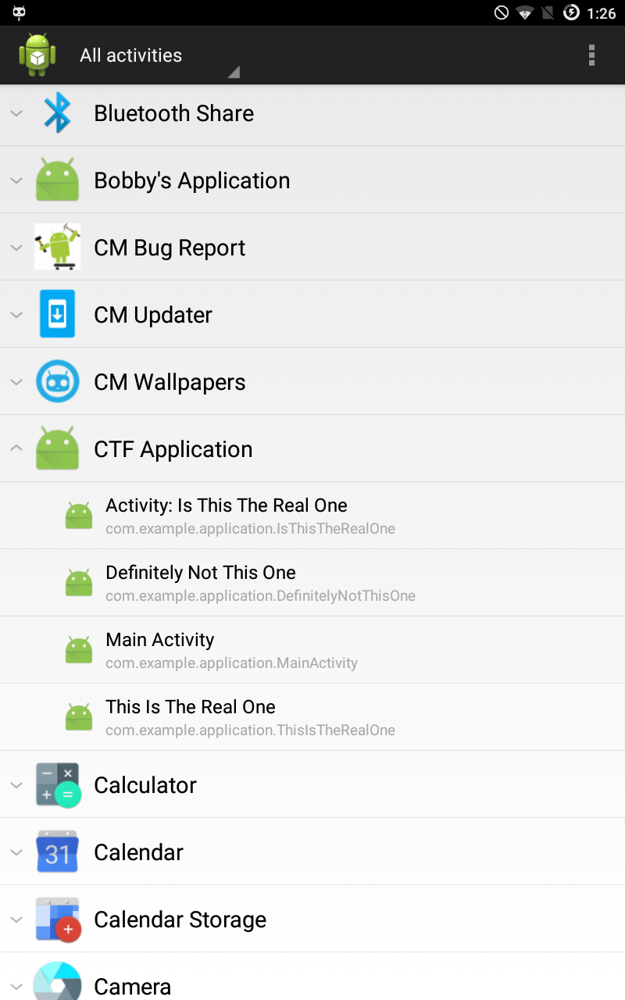

# Ill Intentions

We are given an APK file, the challenge has the following message:

> Do you have have ill intentions?

I quickly decompiled the app with jadx and saw that if we can select the App Activity and receive broadcast message sent by the app, we will have the solution. I didn't have Android IDE installed for this first challenge only an old Android SDK, and apktool.

To be able to start the activities, i just set them as exported and use [Activity Launcer](https://play.google.com/store/apps/details?id=de.szalkowski.activitylauncher). Note: I also change the MainActivity since it doesn't do anything.

```xml
<?xml version="1.0" encoding="utf-8" standalone="no"?>
<manifest xmlns:android="http://schemas.android.com/apk/res/android" package="com.example.hellojni" platformBuildVersionCode="22" platformBuildVersionName="5.1.1-1819727">
    <permission android:description="@string/android.permission._msg" android:name="ctf.permission._MSG" android:protectionLevel="signature"/>
    <permission android:description="@string/android.permission._msg" android:name="ctf.permission._SEND"/>
    <application android:icon="@mipmap/ic_launcher" android:label="CTF Application">
        <activity android:label="Main Activity" android:name="com.example.application.MainActivity" android:exported="true">
       </activity>
        <activity android:label="Activity: Is This The Real One" android:name="com.example.application.IsThisTheRealOne">
  <intent-filter>
                <action android:name="android.intent.action.MAIN"/>
                <category android:name="android.intent.category.LAUNCHER"/>
            </intent-filter>
        </activity>

        <activity android:label="This Is The Real One" android:name="com.example.application.ThisIsTheRealOne" android:exported="true" />
        <activity android:label="Definitely Not This One" android:name="com.example.application.DefinitelyNotThisOne" android:exported="true" />
        <receiver android:exported="true" android:name="com.example.application.Send_to_Activity"/>
    </application>
</manifest>


```



Instead of writing an app to receive the broadcast, I just patch the smalli file, adding some logging with code like this:

```
.method private static strlog(Ljava/lang/String;)V
    .registers 6

    const-string v0, "DefinitelyNotThisOne"

    invoke-static {v0, p0}, Landroid/util/Log;->d(Ljava/lang/String;Ljava/lang/String;)I

    return-void
.end method


#to log, insert this

    invoke-static {v5}, Lcom/example/application/DefinitelyNotThisOne$1;->strlog(Ljava/lang/String;)V    

```

Selecting the correct activity we got this in the log:

```
Congratulation!YouFoundTheRightActivityHereYouGo-CTF{IDontHaveABadjokeSorry}
```


